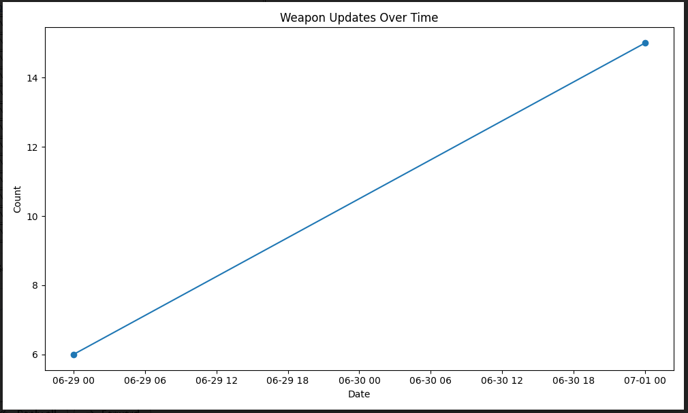

# Weapon Data Report Tool

## Table of Contents

1. [Overview](#overview)

## Overview
This tool generates a report based on weapon data stored in an Excel file. The report includes various statistics and charts that provide insights into the weapon data. The report is sent as an email attachment with additional images embedded in the email.

## Video

[](https://www.youtube.com/watch?v=GIXUm9TXLko)

## Screenshots

<table>
    <thead>
        <th>Excel.xlsx</th>
        <th>create_cfg.py</th>
        <th>report from email</th>
        <th>some charts</th>
    </thead>
  <tbody>
    <tr>
      <td align="center"><a href="https://axbecher.com"><br /></a><br />
      </td>
    <td align="center"><a href="https://axbecher.com"><br /></a><br />
      </td>
      <td align="center"><a href="https://axbecher.com"><br /></a><br />
      </td>
      <td align="center"><a href="https://axbecher.com"><br /></a><br />
      <a href="https://axbecher.com"><br /></a>
      </td>
    </tr>
  </tbody>
</table>

## Installation & Usage

### Step 1: Clone the Repository

Clone this repository to your local machine using the following command:

``` 
git clone <repository-url>
```

### Step 2: Navigate to the Project Directory

Change your current working directory to the root of the cloned repository:

```
cd <repository-directory>
```

### Step 3: Create the Virtual Environment

Run the following command to create a new virtual environment named `myvenv`:

```
python -m venv myvenv
```

This will create a new directory called `myvenv` in your project directory, containing all the necessary files for a virtual environment.

### Step 4: Activate the Virtual Environment

Activate the virtual environment using one of the following commands based on your operating system:

On Windows:

```
myvenv\Scripts\activate
```

On macOS and Linux:

```
source myvenv/bin/activate
```

Once activated, you will see `(myvenv)` in your command prompt, indicating that you are working within the virtual environment.

### Step 5: Install Dependencies

With the virtual environment active, install the required dependencies listed in the `requirements.txt` file:

```
pip install -r requirements.txt
```

This will ensure that all the necessary packages are installed within the virtual environment.

### Step 6: Run `run_generate_report.py`

Now that the virtual environment is set up and the required dependencies are installed, you can run the `run_generate_report.py` script using the following command:

```
python run_generate_report.py
```


The script will now be executed within the virtual environment, utilizing the installed dependencies.

### Step 7: Deactivate the Virtual Environment

Once you have finished running the script and no longer need the virtual environment, you can deactivate it using the following command:

```
deactivate
```

This will return you to your system's default Python environment.

## Customization
You can modify the following parameters in the credentials/config.py file:

- `url`: OneDrive API link to the Excel file containing the weapon data.
- `sender_email`: Email address from which the report will be sent.
- `sender_password`: Password for the sender's email account.
- `receiver_email`: Email address of the recipient.
- `cc_email`: Email address of the recipient to be carbon-copied.
- `subject`: Subject of the email.
- `body`: Body text of the email.
### Additionally, you can customize the charts generated by the script by modifying the corresponding functions in main.py.

# Bash script in order to run this script when windows boots up

```
@echo off
echo Changing directory...
cd /d D:\System\Programs\From_Excel_To_Email_Report_Python\myvenv\Scripts

echo Activating virtual environment...
call activate

echo Running Change Directory with One Level Up
cd ..
cd ..

echo Running Python script...
python run_generate_report.py

pause
```

# Contributors ✨

Thanks go to these wonderful people:

<table>
  <tbody>
    <tr>
      <td align="center"><a href="https://axbecher.com"><br /><sub><b>Alexandru Becher</b></sub></a><br />
      </td>
    </tr>
  </tbody>
</table>

Support
If you encounter any issues or need further assistance, please contact me via [axbecher.com/contact](https://axbecher.com/contact/)
# I'll be happy to help!